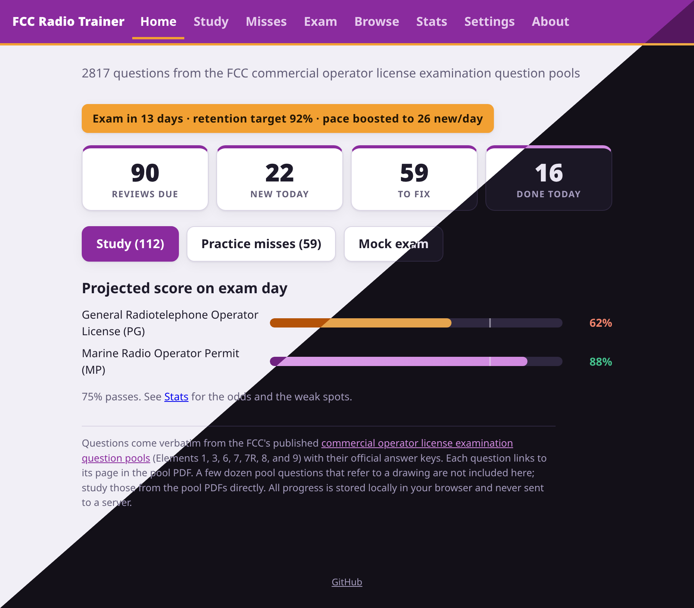

# NC CDL Trainer

[](https://github.com/ullbergm/nc-cdl-test-training/actions/workflows/ci.yml)
[](https://github.com/ullbergm/nc-cdl-test-training/releases)
[](LICENSE)
[](https://nc-cdl.ullberg.io)

[](data/questions.js)
[](package.json)
[](manifest.webmanifest)
[](CONTRIBUTING.md)
[](https://www.conventionalcommits.org/en/v1.0.0/)

Practice questions with spaced repetition for the North Carolina commercial driver
license knowledge tests. The bank has 422 multiple-choice questions covering all 13
sections of the [NC Commercial Driver Manual](https://www.ncdot.gov/dmv/license-id/driver-licenses/new-drivers/Documents/commercial-driver-manual.pdf),
and every question cites the manual page it was drawn from.

Live at [nc-cdl.ullberg.io](https://nc-cdl.ullberg.io), or run it yourself. There is
no build step, no dependencies, and no server. Just open `index.html` in a browser.
All progress is stored locally in the browser and never sent anywhere. Settings has
export and import for backups or for moving between devices.

<p align="center">
  
</p>
<p align="center">
  <a href="docs/screenshots/README.md">More screenshots</a>
</p>

## Modes

- **Study**: the spaced repetition queue. Due reviews plus a daily allotment of new
  cards, drawn round-robin across the selected sections and interleaved with the
  reviews. Wrong answers come back a few cards later in the same session. Correct
  answers are rated Hard, Good, or Easy, which tells the scheduler how the recall felt.
  Feel like doing more once the queue is empty? The home and session-complete screens
  offer 5, 10, or 25 extra new cards; the extra applies to today only and your
  configured pace is untouched.
- **Misses**: re-drills every question whose last answer was wrong, without touching
  the review schedule. Answering one correctly removes it from the pool.
- **Exam**: mock knowledge tests in the real format. No feedback until the end, and
  80% to pass. The list mirrors the actual NC test structure (General Knowledge, Air
  Brakes, Combination Vehicles, and the endorsement tests) and shows only the tests
  selected in Settings. Missed exam questions feed the Misses pool.
- **Browse**: the whole bank by manual section, with each card's schedule and accuracy.
- **Stats**: mastery counts, day streak, 7-day due forecast, per-section accuracy,
  and exam history.

On a keyboard, 1 through 4 pick an answer, Enter continues after a wrong answer,
and 1/2/3 (or Enter for Good) grade a correct one. A stray tap is not final: an
Undo button (or the U key) on the feedback screen takes back the answer and asks
the question again, as long as you have not yet continued or graded. The buttons
show badges for their shortcut keys on devices with a mouse and keyboard; on
touch screens the badges stay hidden.

In Settings, under "Tests I'm studying for", check only the tests you are taking
next, for example General Knowledge, Air Brakes, and Combination Vehicles for a
first Class A attempt. Everything else stays out of the queue until you check it,
and progress on unchecked sections is kept.

## Scheduling

The scheduler implements [FSRS-6](https://github.com/open-spaced-repetition)
(Free Spaced Repetition Scheduler) with its published default parameters. FSRS
models each card with three quantities:

- Difficulty: how hard the card is for you, on a scale of 1 to 10, adjusted by
  each answer.
- Stability: how durable the memory is, measured as the number of days until recall
  probability falls to 90%. Successful reviews grow it, and a miss collapses it.
- Retrievability: the predicted chance of recalling the card right now, which decays
  along a power-law forgetting curve.

Each review updates difficulty and stability from your rating, then schedules the
next review for the day retrievability is predicted to reach the target, shortly
before you would likely forget. Intervals grow quickly for cards you keep getting
right and reset for cards you miss. Repeat answers within the same day use a
separate short-term memory formula. Intervals of three days or more get a small
deterministic fuzz (up to about 5%) so cards learned together drift apart
instead of always coming due on the same day.

Every scheduled review is also appended to a compact log (question, rating,
timestamp) that is kept with your progress and included in backups. Nothing
reads it yet; it exists so a future version can fit the FSRS parameters to
your actual review history instead of the published defaults, which the
aggregate card state alone could never support.

## Studying for a date

Set your test date in Settings and the scheduler optimizes for that day instead of
indefinite retention:

- The retention target ramps from 90% to 95% over the final three weeks.
- No review is scheduled past the exam. Anything that would land later is pulled
  back to exam day.
- If the daily new-card pace is too slow to cover every remaining question in time,
  it is raised automatically. Your stored setting is untouched, the boost is shown
  on the home screen, and it goes away when the date is cleared.
- In the last five days a "Final review sweep" appears on the home screen. It goes
  through every card, weakest memory first, ignoring due dates.

Without an exam date the app runs at your own pace with the normal 90% target. The
same applies automatically once the date passes.

## Layout

```
index.html               app shell
css/style.css            styling (light/dark follows the device; Settings can force either)
js/fsrs.js               FSRS-6 scheduler
js/storage.js            localStorage persistence, export/import
js/app.js                UI and session logic
data/questions.js        question bank (422 questions, tagged by section and manual page)
sw.js                    service worker (offline cache, only active on the hosted site)
manifest.webmanifest     PWA manifest, lets the app be installed to a home screen
icons/                   app icons (icon.svg is the source, PNGs rendered from it)
tests/validate-bank.js   question bank schema checks (node)
tests/fsrs-test.js       FSRS scheduler property tests (node)
tests/test.html          end-to-end tests driven through the real UI
tests/run-browser.sh     headless-Chrome runner for test.html (local + CI)
```

On the hosted site the app is an installable PWA: a service worker caches
everything on first load, so it keeps working offline, and "Add to home screen"
installs it like an app. Each release stamps its version into the service
worker, so open tabs notice the new deploy, show a "new version is ready"
toast, and switch over cleanly on reload; otherwise the release is picked up
on the next load.

## Releases and deployment

Two workflows in `.github/workflows/`:

- CI (`ci.yml`) validates the question bank and runs the browser test suite on every
  push to `main` and every pull request.
- Release (`release.yml`) uses [release-please](https://github.com/googleapis/release-please)
  to maintain a release PR from [Conventional Commit](https://www.conventionalcommits.org/)
  messages. Merging that PR tags a version, publishes a GitHub release with a
  generated changelog, and deploys to GitHub Pages. Ordinary pushes to `main` do not
  touch the live site. The deploy job re-runs the tests before publishing.

To run the checks locally:

```
npm install          # one time, dev tooling only (the app itself has no dependencies)
npm run lint
npm test             # question bank validation + FSRS scheduler tests
npm run test:browser # end-to-end suite in headless Chrome or Chromium
```

Every line should say `PASS`. Opening `tests/test.html` in a normal browser also
works, with the results printed at the bottom of the page. The test page clears the
app's localStorage for its origin, so do not run it in the browser profile where you
keep real study progress.

## Accuracy

The questions were authored from the manual's text, section by section. Accuracy is
not guaranteed. Each question carries the manual page it came from (like `5-3`), so
verify anything important against the source. The actual DMV exam questions are not
publicly available, and no claim is made that these questions match or resemble
them. This is a study aid for the manual's content, not a copy of the test. If a
question reads wrong, check the cited page and edit `data/questions.js`, which is a
plain JSON array.

The manual PDF is copyright AAMVA and is not included in this repository. Download
it from NCDMV at the link above.

## License

[MIT](LICENSE)
