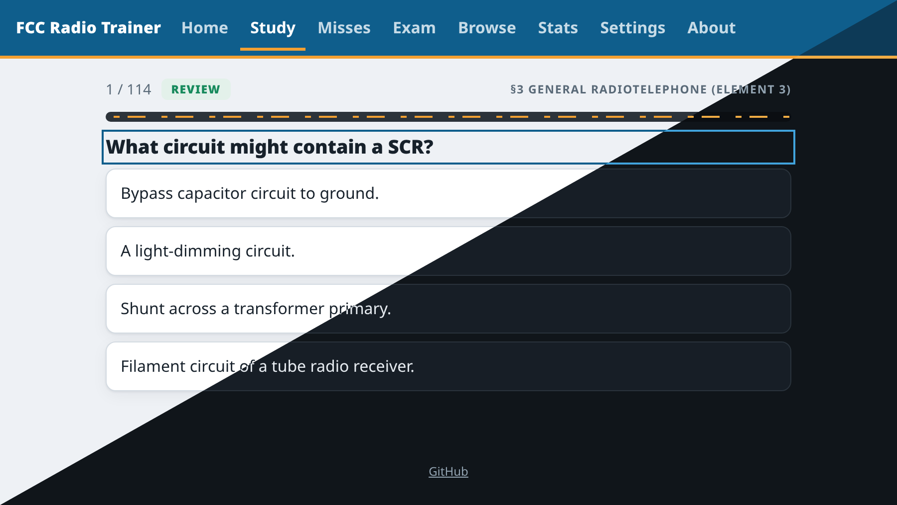
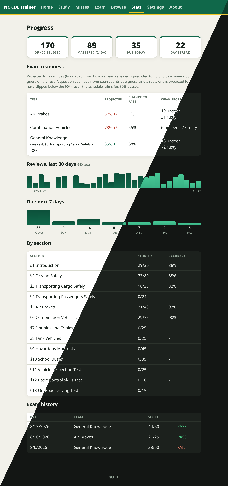

# Screenshots

Each image is split diagonally to show the light and dark themes, which follow the
browser's color scheme preference.

## Home

Due reviews, new cards for the day, the misses pool, and an exam countdown banner
when a test date is set.

## Study

A spaced repetition session. The progress bar is styled as highway lane markings,
and the header shows the manual section the question came from.

## Stats

Mastery tiles, a 7-day due forecast, per-section progress and accuracy, and exam
history.

